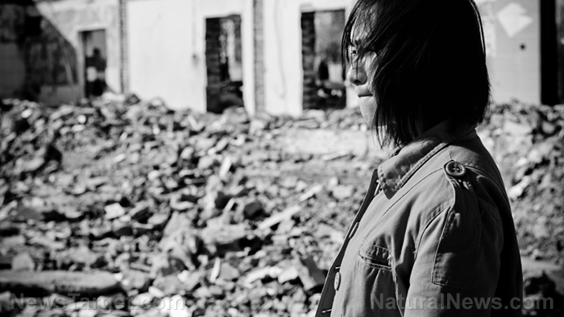

You left the person on their own to get out. They aren't able to. But you leave them and now you're on your own. You try seeing if any stores were around to take food from, but there are none. Talking to the person has made them all fall apart, leaving you with no options. You go in a hiding spot, which was safe but you have nothing to eat.

**YOU DIED FROM STARVATION...** [_Start over?_](../intro/beginning.md)
