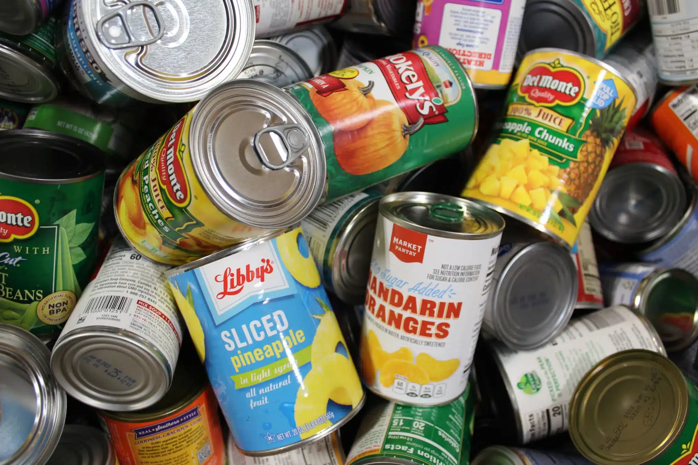
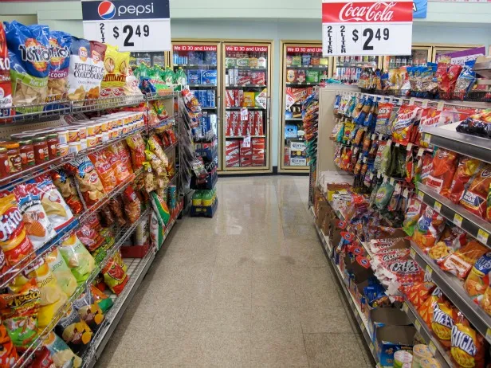

You find a store with some food left. You have some options. There are some snacks, which is junk food. Yummy, but you're not sure. There are also cans of food, which will last you longer but may not taste as good as junk food. The choice is yours now, take the canned food or the junk food? Choose wisely.

1. [Take the canned food](canned.md)

2. [Take the junk food](junk.md)

